--- 
parser: v2 
auto_validation: true 
time: 10 
tags: [ tutorial>beginner, software-product-function>sap-hana-cloud--sap-hana-database, software-product>sap-hana] 
primary_tag: software-product>sap-hana-cloud 
--- 

 

# Browse and Explore Catalog Objects with the Database Objects App
<!-- description --> Dive into using the Database Objects tool to explore and inspect objects in an SAP HANA database.  

## Prerequisites 
- An SAP HANA Cloud database such as SAP HANA Cloud trial where the Database Objects tool is available.  
- You have completed the first 3 tutorials in this group 

 

## You will learn 
- How to filter for specific tables and schemas within an instance 
- How to inspect and explore objects in an SAP HANA Cloud database 
- Generating SQL Statements for specific schemas for selected database objects
---

### Introduction 
>Database Objects is a built-in tool in SAP HANA Cloud Central that enables you to search, view metadata, and generate SQL for catalog objects, right from SAP HANA Cloud Central. 

 
### Filters and Navigation  

1. To navigate to the Database Objects tool, click on the icon for it on the left-hand side of the instances page. 
   
    <!-- border -->
    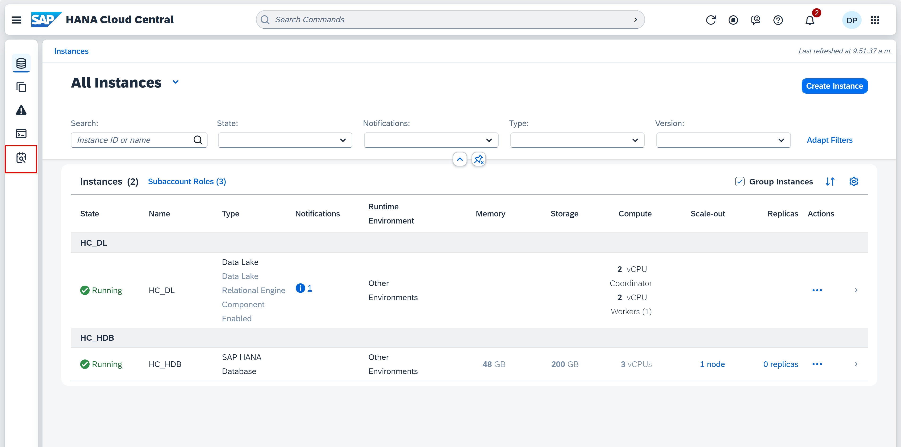 

2. Upon opening Database Objects all filters are empty except the **Instance Type** which pre-selects all types you have existing instances for.  

    <!-- border -->
     
    Click the drop down under the **Instance** filter to select your SAP HANA Database instance. 

    <!-- border -->
     
    Once selected, the **Schema** and **Search** filter are both available to use. Select the **Schema** filter and search for the HOTELS schema.  

    <!-- border -->
     
    You can also directly search for the schema or any other objects directly in the **Search** filter. In this case after searching navigate to the **Schemas** tab directly to view the metadata for the HOTELS schema. This data includes ownership, privileges and create time.  

    <!-- border -->
    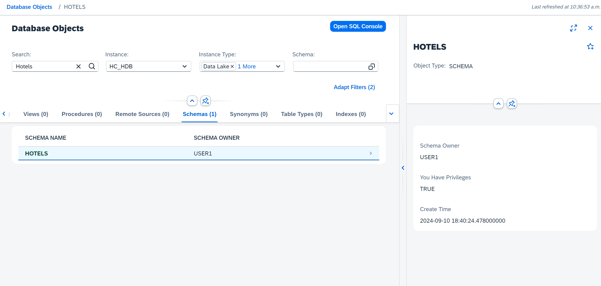 

 

### Explore Tables 

Database Objects table features can be leveraged to view table information such as columns, indexes, properties, runtime information and SQL CREATE Statements.  

1. Select the **Tables** tab to view all associated tables of the HOTELS schema.  

    The page now displays all tables in the schema HOTELS and their table type.

    <!-- border -->
    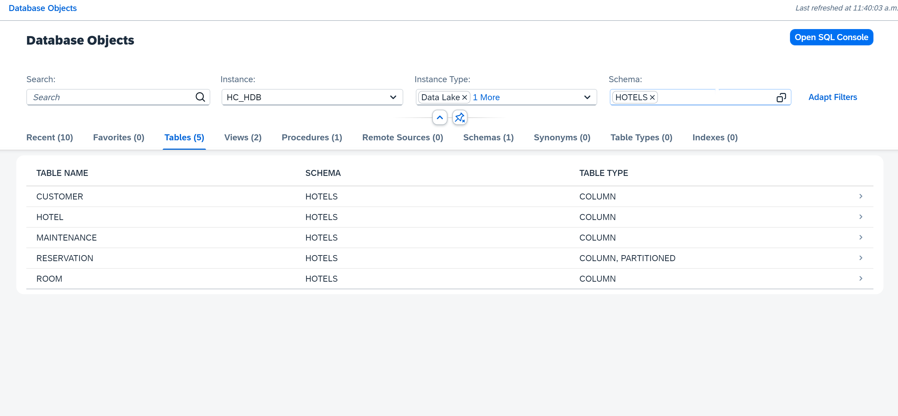

2. Select the **RESERVATION** table to explore it further.  

    Click the full screen icon on the top right of the screen to maximize the page and view all tabs.

    <!-- border -->
    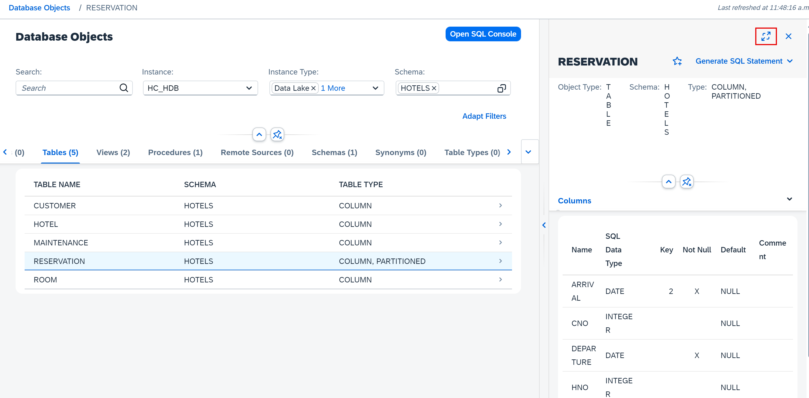 

    By default you should see the column details for the table.  

    <!-- border -->
    

3. Explore the **Runtime Information** tab, where further information about the table can be found. This information includes the total number of rows, disk size, partitions and memory consumption for the table, as well as individual columns. 
   
    <!-- border -->
    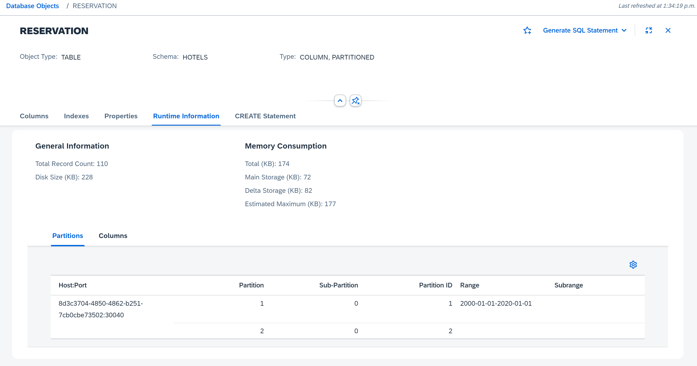 

4. Examine the other tabs, such as **CREATE Statements**, where SQL code to generate the table can be found.  
    
    <!-- border -->
    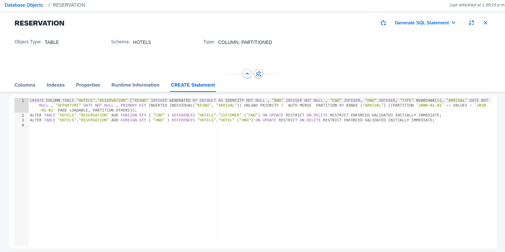 

5. Select the Generate SQL Statement dropdown to see the three ways to have SQL generated for the table.  
    
    <!-- border -->
     

 

### Explore Functions and Procedures 

1. Navigate to settings and enable the functions object type to view functions in the Database Objects app.

    

2. Open the **Functions** tab and select AVERAGE_PRICE to examine it further.  
    
    <!-- border -->
    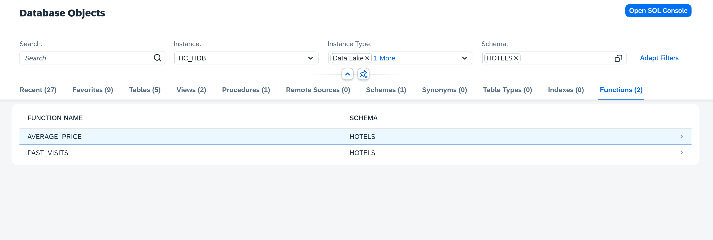 

    Select the Generate SQL Statement dropdown and click SELECT Statement to navigate to the SQL Console.

    Input *'suite'* in the single quotes of the SELECT statement to get the average price for suites. 
    
    <!--border -->
    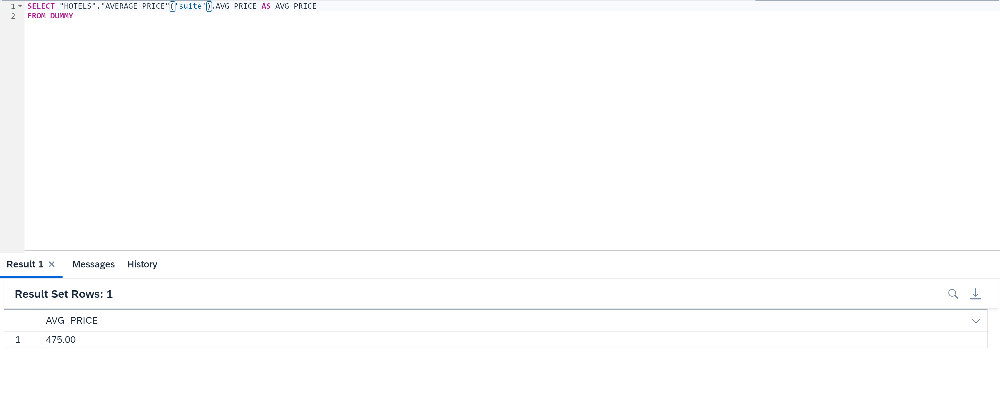

3. Navigate back to the Database Objects app and open the **Procedure** tab. Select RESERVATION_GENERATOR to examine it further.  
    
    <!-- border -->
    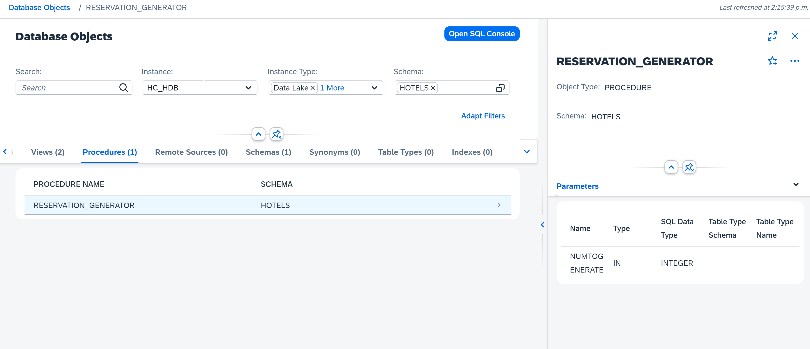 

4. Click Generate SQL to get SQL that runs the stored procedure. 
    
    <!-- border -->
    

To learn more about exploring database instances in Database Explorer refer to the [Browse Schema with the Database Browser in SAP HANA Database Explorer Tutorial](hana-dbx-browse) 

### Additional Features 
 

1. Select the **Recent** tab to view all the recent objects you opened.  
    
    <!-- border -->
    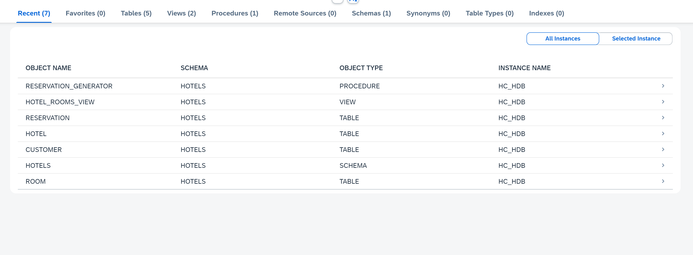 

2. Navigate to an object and click the star icon on the top right of the screen to favorite it. Allows for easy access to the object through the **Favorites** tab.  
    
    <!-- border -->
    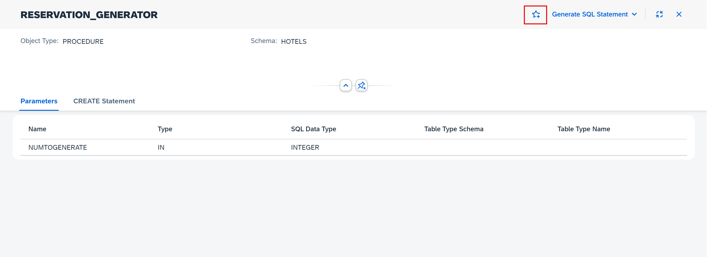 

    Once selected as a favorite. Navigate to the **Favorites** tab to see it. 
    
    <!-- border -->
     

3. Click All/Selected Instance toggle to filter favorites. 
    
    <!-- border -->
    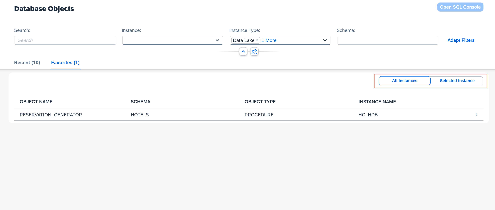 

4. Navigate to HANA Cloud Central settings to customize preferences for the Database Objects App. 
    
    <!-- border -->
    

### Knowledge check
Congratulations! You have now successfully navigated the Database Objects app and learned about the various features and tools available to you right from SAP HANA Cloud Central.  

 
